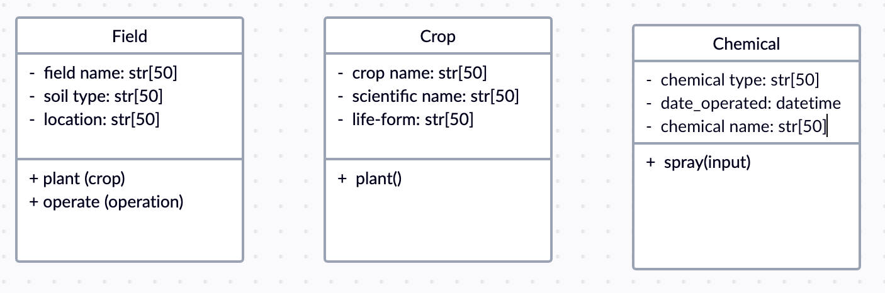

# Project Overview

**Goal**: all the ACRE historical field data resides in a logically structured database that allows for easy searching and exploration of the data

**User**: workers at ACRE.
Can use this webpage to input new data into the the application

**Data Model**

I chose field, crop, and chemical to be my classes. Field represent the different fields in ACRE, crop represent different crops planted in different fields, and chemical represent the different chemical materials applied in different fields.

They related in each other in different ways. Fields can input crop and chemicals. Crop and chemical can be inputted in Fields.

I chose to model the data in this manner because it is straight forward to the majority input and cost of a farm. Each class can be reviewed separately and convenient to manage the costs.
